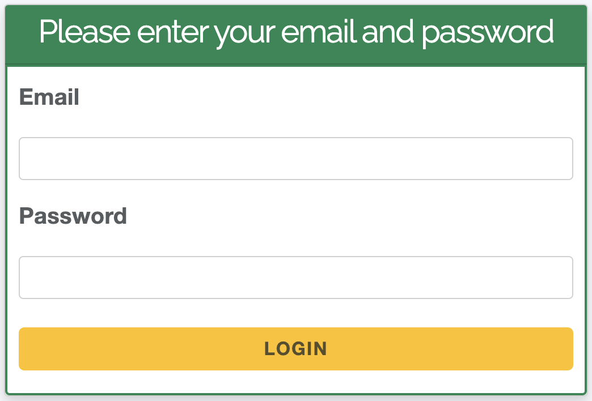

# CakePHP Birthday Planner and Task Manager for Kids



## Installation

Download [Composer](https://getcomposer.org/doc/00-intro.md) and install PHP dependencies

```bash
composer install
```

Clone the repository

```bash
git clone git@github.com:katiaku/MyBirthDay.git
```

Start the local server

```bash
bin/cake server
```

You can now access the server at `http://localhost:8765` to see the welcome page.

## Configuration

Configure your database settings in the `config/app_local.php` file.

Set the database connection in the `config/app.php` file.

Create your database and run the database migrations

```bash
bin/cake bake migration CreateTableName variable:type
bin/cake migrations migrate
bin/cake bake all TableName
```
