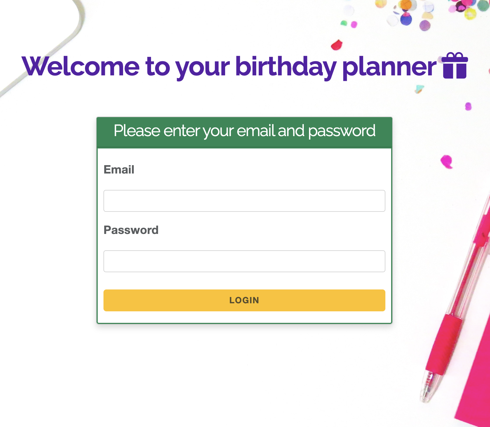

# CakePHP Birthday Planner and Task Manager for Kids

## Overview

The CakePHP Birthday Planner and Task Manager for Kids is a web application designed to help parents plan and manage
their children's birthday parties. The app provides an intuitive interface that allows users to organize party details
including lists of guests and presents.



## Installation and Configuration

To install the CakePHP Birthday Planner and Task Manager for Kids, follow these steps:

Download and install [Composer](https://getcomposer.org/doc/00-intro.md) to manage the PHP dependencies required by the app.

Clone the repository from GitHub:

```bash
git clone git@github.com:katiaku/MyBirthDay.git
```

Install the PHP dependencies using Composer:
```bash
composer install
```

Configure the database settings in the `config/app_local.php` file.

Set up the database connection in the `config/app.php` file.

Create the database tables by running the database migrations:
```bash
bin/cake bake migration CreateTableName variable:type
bin/cake migrations migrate
bin/cake bake all TableName
```

Start the local server:
```bash
bin/cake server
```

Access the app in your web browser by navigating to `http://localhost:8765`.
